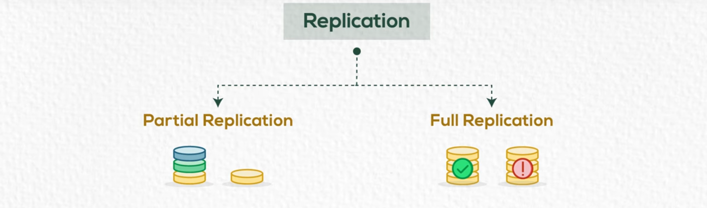

# Chapter 01 Introduction

## Weakness of file Based System

 -  Separation and Isolation of data
 -  Duplication of data
 -  Program Data Dependence
 -  Incompatible file formats

**Database:-** A collection of related data

---

## Database Management System(DBMS)

A software package/system to facilitate the creation and maintenance of a computerized database.

---

## Database System

The DBMS software together with the data itself sometimes, the applications are also included **(Software + DB)**.

---

## Database System Main Components

---

## Stored DB Definition (Metadata)

- Table Name
- Column Name
- Column data types
- Constraints
- Access Privileges
- Username
- Password
- User's Privileges
- DB objects structure
- Log files

| Meta Data     | Stored Data |
| ------------- | ----------- |
| Name          | Mohamed     |
| Date of Birth | 80          |
| Salary        | 10000       |

---

## Advantages of database systems

- Controlling Redundancy
- Restricting Unauthorized Access
- Sharing Data
- Enforcing Integrity Constraints. (Unique Data Values)
- Inconsistency can be avoided
- Providing Back up and Recovery

---

## Disadvantages of database systems

- Needs expertise to use
- DBMS is expensive
- May be incompatible with any other available DBMS

---

## Database Users

---

## DBMS Architecture (Three Schema Architecture)

---

## Data Models

---

**Mapping**: The process of transforming requests and results between levels.

---

## DBMS other functions 

- Text / Number / Image / Audio / Video
- Spatial Data
- Time Series
- Data Mining

---

## Centralized DB Environment 

- Mainframe environment 

- Client / server environment

- Internet computing environment

---

## Distributed Database

---
