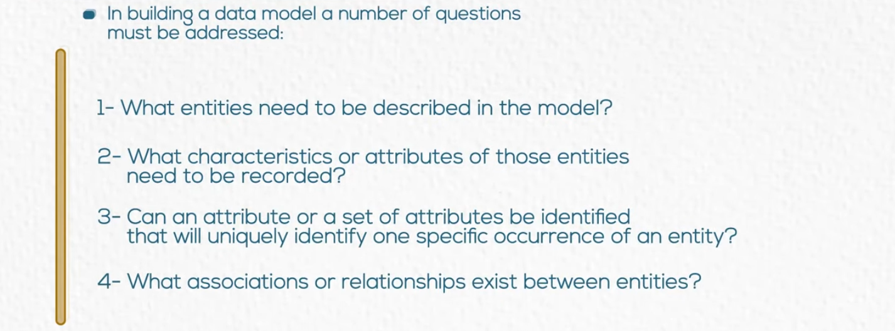
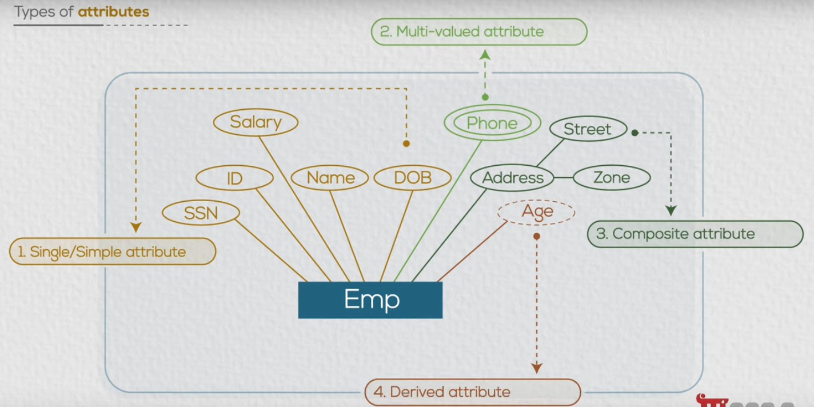
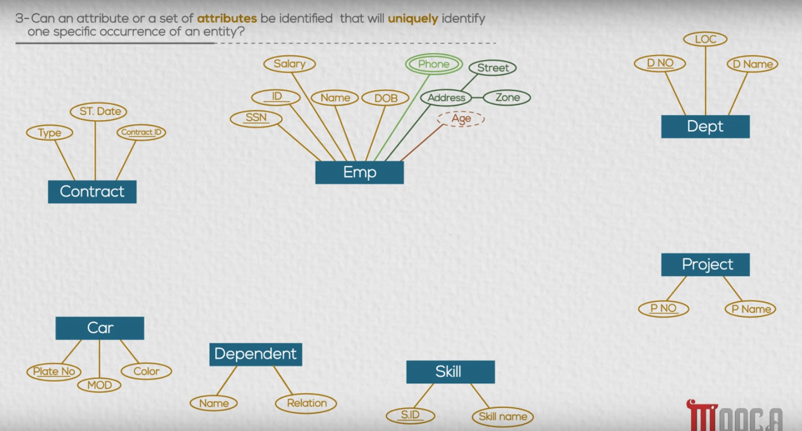
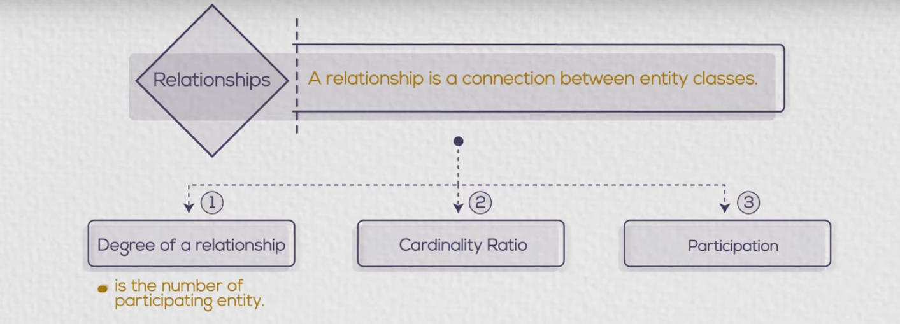
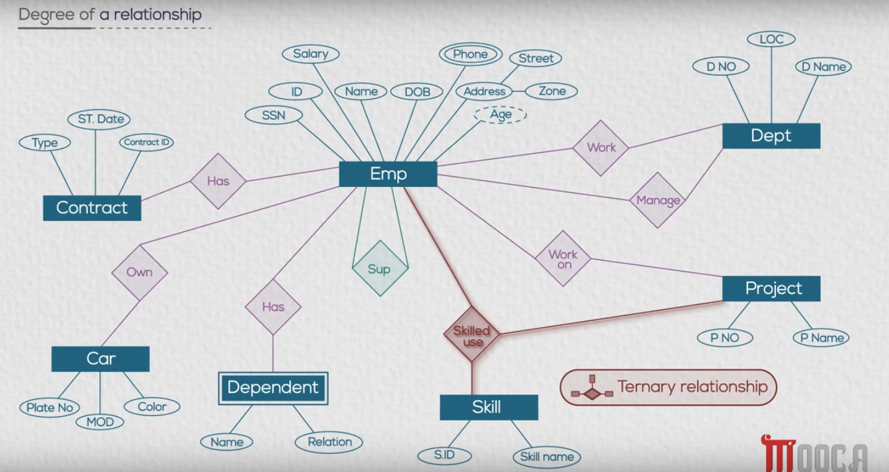
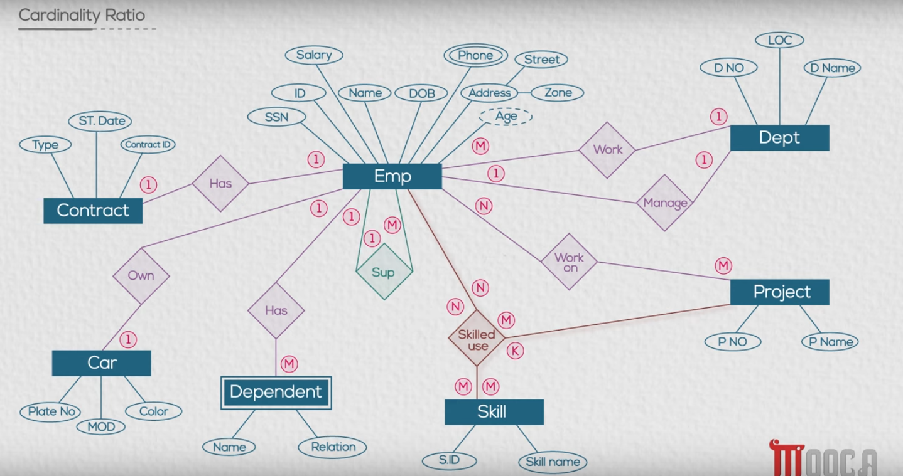
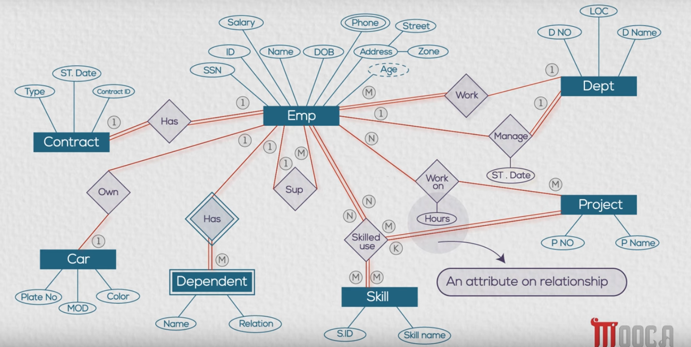

# Chapter 02 Entity Relationship Diagram (ERD)

**ERD**: Identifies information required by the business by displaying the relevant entites and relationships between them.

---

**Entity**: Is a thing in the real world with an independant existence. (Pysical or Conceptual existence)

---

---

### Entity Relationship Modeling

---

#### 1- What entities need to be described in the model?

**Employess**

#### 2- What characteristics or attributes of those entities need to be recorded?

---

#### 3- Can an attribute or a set of attributes be identified that will uniquely identify one specific occurence of the entity?

---

### Important Definitions

- **Attribute**: The property of an entity that describes its characteristics.
- **Single/Simple Attribute**: An attribute that can have only one value.
- **Composite Attribute**: An attribute that can be divided into smaller subparts. (e.g., address)
- **Multivalued Attribute**: Has a set of values for the same entity instance. (e.g., phone numbers)
- **Derived Attribute**: An attribute that is calculated from other attributes. (e.g., age from birth date)
- **Candidate Key**: When an entity has more than one key, those are candidate keys. (e.g., employee_id, SSD, email)
- **Weak entity**: An entity that doesn't have a key attribute and must be fully dependant on another entity.
- **Relationships**: The connection between entity classes. (e.g., one-to-one, one-to-many, many-to-one, many-to-many)

---

### Degree of Relationships

---

### Cardinality Ratio

---

### Participation

---
