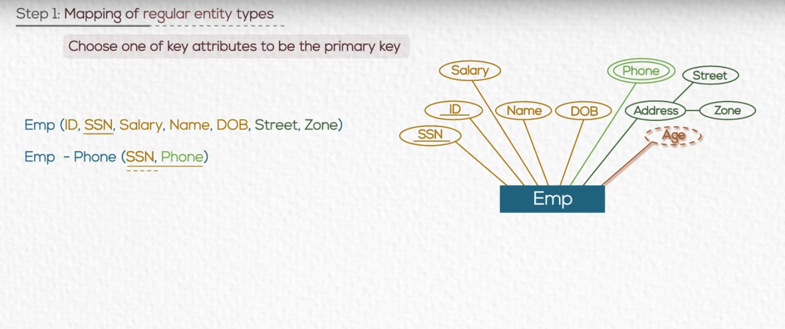
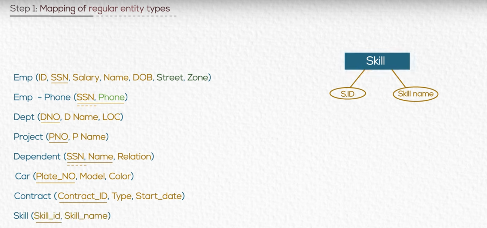
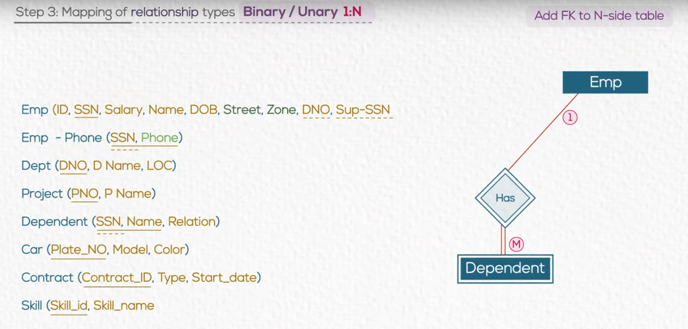
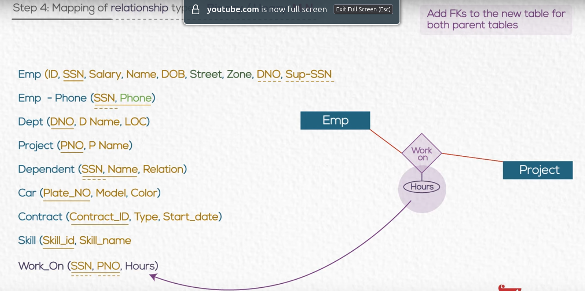
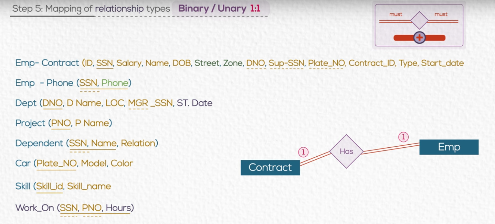
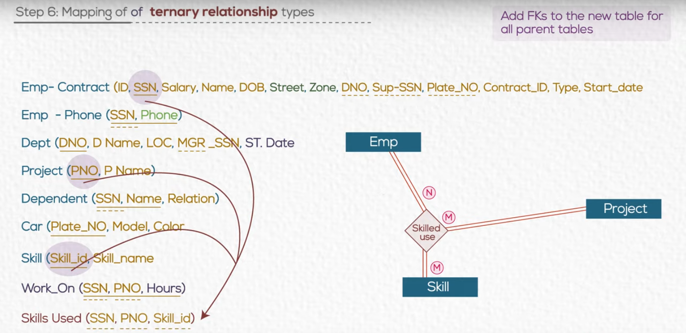

# Chapter 03 ERD Mapping to Tables 

### Relation DB

#### This relation contains the following compenants:
- **Tuples**: A collection of rows that represent the records in the relation.
- **Primary Key**: A unique identifier for each tuple in the relation, can't be null.
- **Columns**: The attributes of the relation, each column has a unique name and data type.
- **Domain**: Intersection of column and tuple which must be single value

---

### Logical Design

---