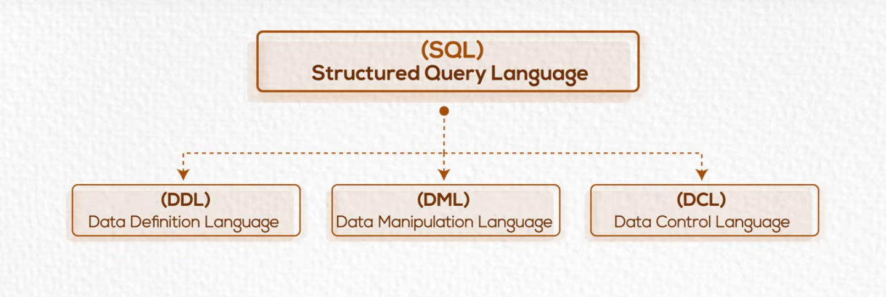
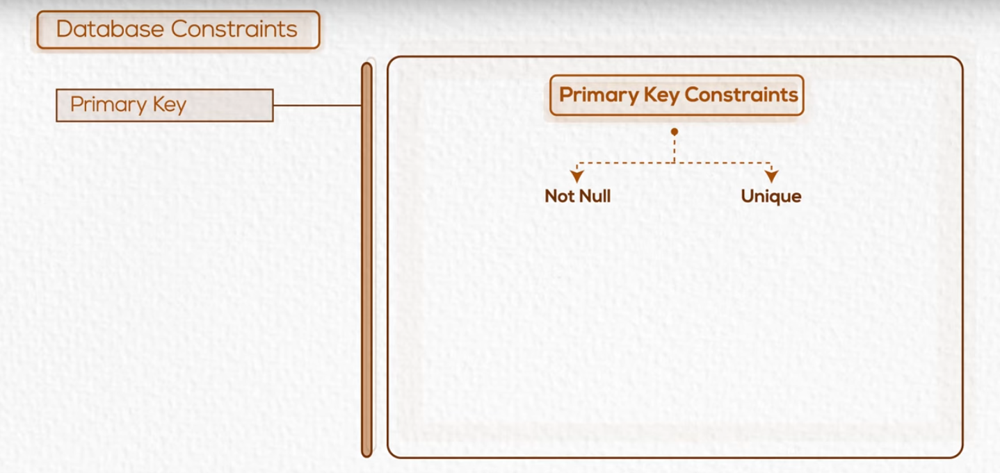
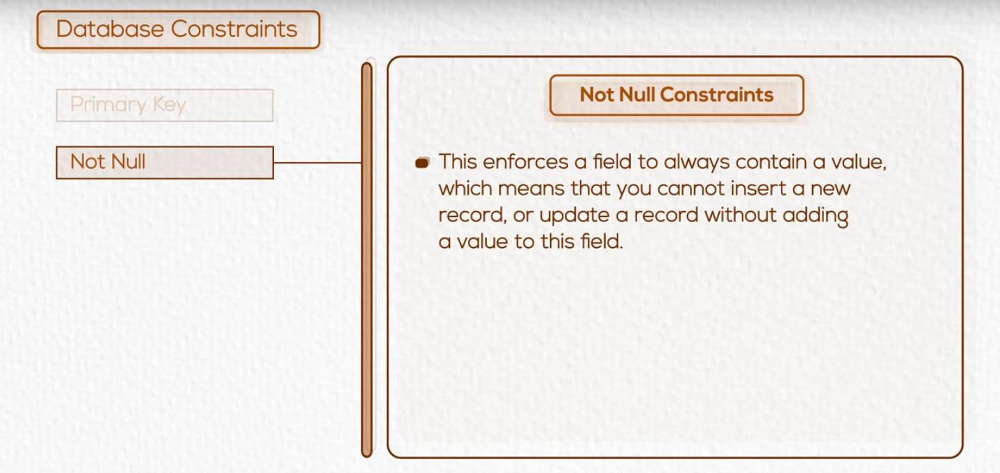
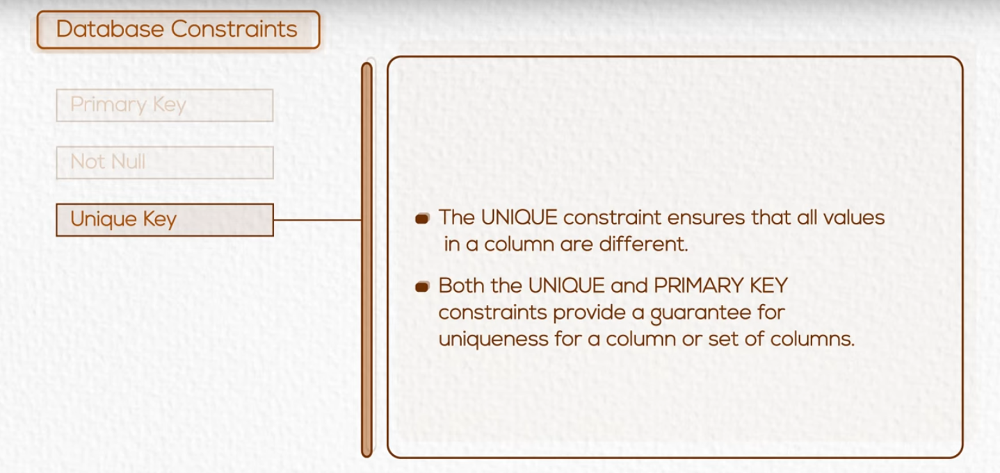
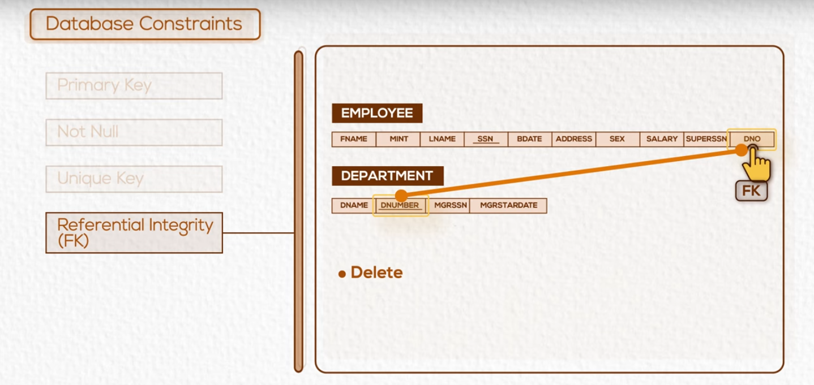
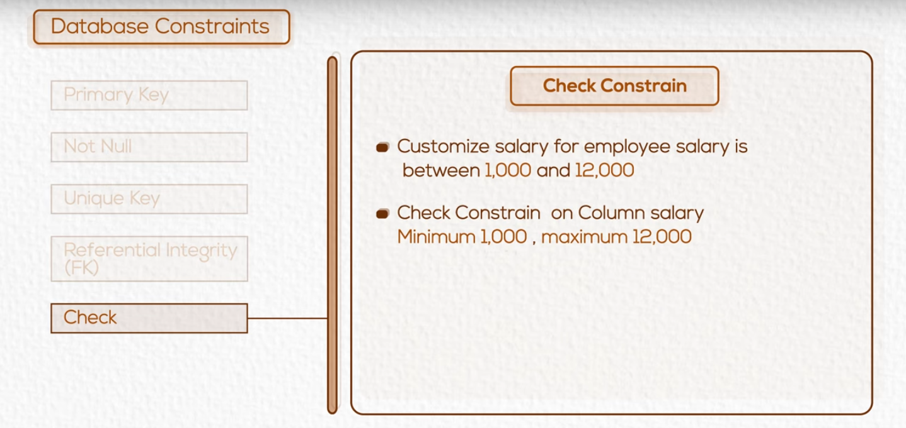
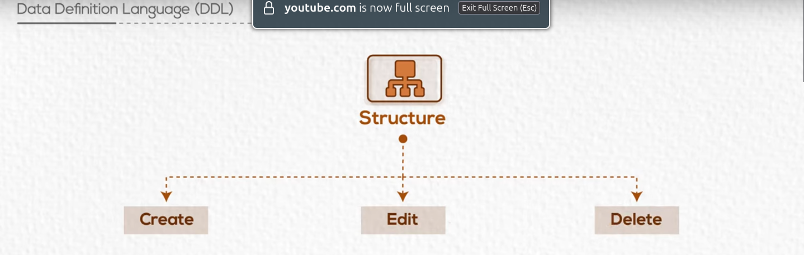
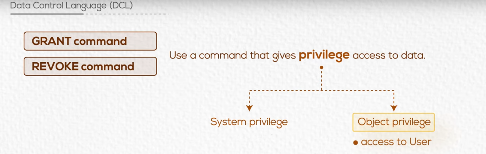
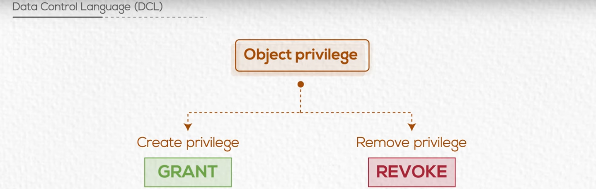

# Chapter 04 Structured Query Language(SQL) 

## SQL



---
## Database Schema & Constraints 

### Database Schema

- A Schema is a group of related objects in a DB
- There is only one owner of a Schema who has access to mainipulate the structure of any object in the Schema
- The schema doesn't represent a person, although the schema is associated with a user

---

### Data types

A data types determines the type of data that can be stored in a column.

#### The most commonly used data types are:
- **INT**: Integer
- **VARCHAR**: Variable length string
- **CHAR**: Fixed length string
- **DATE**: Date
- **FLOAT**: Floating point number
- **NUMERIC**: Fixed point number
- **Alphanumeric**: Alphanumeric string

---

### Database Constraints

Reserictions on DB table or object to maintain intergrity of data.

For example:
- **PRIMARY KEY**: A column that uniquely identifies each row in a table.

- **NOT NULL**: A column cannot have a NULL value.

- **UNIQUE Key**: A column must have a unique value.

- **Referencial Integrity(FK)**: A column that refers to the primary key of another table.

- **CHECK**: A condition that must be true for each row in a table.


---


## Data Definition Language (DDL)



---

### Commands

- **CREATE command**
- **ALTER command**
- **DROP command**
- **TRUNCATE command**

### Tasks

- Create students table with ID, PK, First Name, Last Name,  Address,City, Country, and Date of Birth.

```sql
CREATE TABLE students (
    ID NUMERIC PRIMARY KEY,
    First_Name VARCHAR(50) NOT NULL,
    Last_Name VARCHAR(50),
    Address VARCHAR(50),
    City VARCHAR(50),
    Country VARCHAR(25),
    Birth_Date DATE
);
```
- Add column postal code

```sql
ALTER TABLE students ADD Postal_Code VARCHAR(10);
```

- Remove Column Country


```sql
ALTER TABLE students DROP COLUMN Country;
```

- Remove Table Student

```sql
DROP TABLE students;
```

---

## Data Control Language (DCL)

### Commands

- **GRANT command**
- **REVOKE command**

---





---

### First Create Emp and Dept Tables

```sql
CREATE TABLE Emp (
    ID numeric NOT NULL,
    SSN numeric primary key,
    Salary numeric NOT NULL,
    Name VARCHAR(50) NOT NULL,
    DOB DATE NOT null,
    Street VARCHAR(50) NOT null,
    Zone VARCHAR(50) NOT null,
    DNO int NOT null,
    Sup_SSN numeric
    
)

CREATE TABLE Dept (
    DNO numeric NOT NULL,
    D_Name VARCHAR(50) NOT NULL,
    LOC VARCHAR(50) NOT null,
    MGR_SSN numeric,
    st_date DATE NOT null
)
```
### Second Create Roles

```sql
create role ahmed;
create role mary;
```

### Third Grant Privileges to Users

```sql
grant select on table emp to Ahmed;

grant all on table dept to mary,ahmed;

grant select on table emp to ahmed with grant OPTION;
```


### Fourth Revoke Privileges from Users

```sql
revoke update on table dept from mary;

revoke all on table dept from mary,ahmed;
```


---

