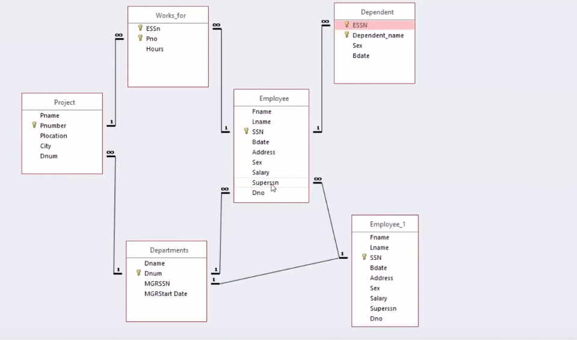
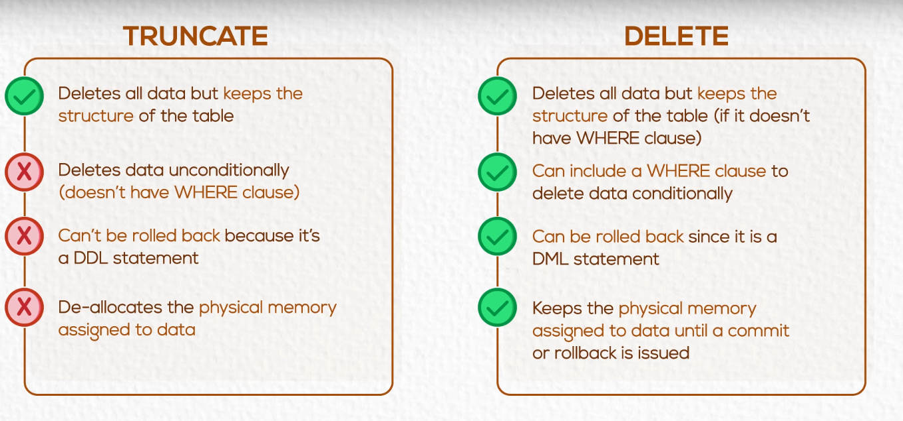

# Chapter 05 Data Manipulation Language (DML)

#### Commands

- **INSERT command**
- **UPDATE command**
- **DELETE command**
- **SELECT command**

---



---

```sql
-- ========================
-- Database: Company Schema
-- ========================

-- 1. Departments Table
-- This is the parent table for both employees and projects
CREATE TABLE departments (
    Dname VARCHAR(50) NOT NULL,
    Dnum SERIAL PRIMARY KEY,                  -- Department number (PK)
    MGRSSN NUMERIC NOT NULL UNIQUE,           -- Manager SSN (will be FK later)
    MGRStart_Date DATE NOT NULL
);

-- 2. Employees Table
-- Contains employee data and references departments
CREATE TABLE employees (
    Fname VARCHAR(50) NOT NULL,
    Lname VARCHAR(50) NOT NULL,
    SSN NUMERIC PRIMARY KEY,                  -- Employee SSN (PK)
    Bdate DATE NOT NULL,
    Address VARCHAR(50) NOT NULL,
    Sex CHAR(10) NOT NULL,
    Salary NUMERIC NOT NULL,
    Superssn NUMERIC,                         -- Self-reference to manager
    Dno INTEGER NOT NULL,                     -- FK to department

    -- Relationships
    FOREIGN KEY (Dno) REFERENCES departments(Dnum),      -- 1:M with departments
    FOREIGN KEY (Superssn) REFERENCES employees(SSN)     -- 1:M self-reference
);

-- 3. Project Table
-- Each project is managed by one department
CREATE TABLE project (
    Pname VARCHAR(50) NOT NULL,
    Pnumber SERIAL PRIMARY KEY,               -- Project number (PK)
    Plocation VARCHAR(50) NOT NULL,
    City VARCHAR(50) NOT NULL,
    Dnum INTEGER NOT NULL,                    -- FK to department

    -- Relationships
    FOREIGN KEY (Dnum) REFERENCES departments(Dnum)      -- 1:M with departments
);

-- 4. Dependent Table
-- Each dependent belongs to one employee
CREATE TABLE Dependent (
    ESSN NUMERIC NOT NULL,                    -- FK to employee
    Dependent_name VARCHAR(50) NOT NULL,
    Sex CHAR(10) NOT NULL,
    Bdate DATE NOT NULL,

    -- Composite PK: one employee can have multiple dependents, but names must be unique per employee
    PRIMARY KEY (ESSN, Dependent_name),

    -- Relationships
    FOREIGN KEY (ESSN) REFERENCES employees(SSN)         -- 1:M with employees
);

-- 5. Works_for Table
-- Join table for many-to-many between employees and projects
CREATE TABLE Works_for (
    ESSN NUMERIC NOT NULL,                    -- FK to employee
    Pno INTEGER NOT NULL,                     -- FK to project
    hours NUMERIC NOT NULL,

    -- Composite PK: ensures no duplicate project assignment for same employee
    PRIMARY KEY (ESSN, Pno),

    -- Relationships
    FOREIGN KEY (ESSN) REFERENCES employees(SSN),        -- M:N with employees
    FOREIGN KEY (Pno) REFERENCES project(Pnumber)        -- M:N with projects
);
```


- departments is the parent for both employees and project (1:M)

- employees has a self-referencing FK (Superssn)

- Dependent and Works_for both use composite primary keys

- Works_for creates a many-to-many relationship between employees and project


---

## INSERT Command


```sql
-- Insert full data of employee (Ahmed, Hassan, 102672, 8/8/1988, 20 El-Haram st, M, 2000, 112233, 30)

insert into employees values (
'Ahmed', 'Hassan', 102672, '8/8/1988', '20 El-Haram st', 'M', 2000, 112233, 30)
```


```sql
-- Insert full data of employee (Moheb, Rafat, 102674, 5/6/1984, 6 Makram ebid st, M, 1600, 112233, 30)

insert into employees (fname, lname, ssn, bdate, address , sex, salary, superssn, dno)
Values('Moheb', 'Rafat', 102674, '6/5/1984', '6 Makram ebid st', 'M', 1600, 112233, 30)
```


```sql
-- Insert data of employee (Asmaa, Ali, 102660, 18/10/1985, F,10)

-- Change the address, salary, and dno columns to accept nulls
ALTER TABLE employees
ALTER COLUMN dno DROP NOT null,
ALTER COLUMN address DROP NOT null,
ALTER COLUMN salary DROP NOT NULL;

-- Now Insert data
insert into employees (fname, lname, ssn, bdate, sex, dno)
values ('Asmaa', 'Ali', 102660, '10/18/1985', 'F', 10)
```
---

## UPDATE Command

```sql
-- Update salary for the employee whose ssn is 102660 to be 1200

update employees e 
set salary=1200
where e.ssn = 102660
```

```sql
-- Update salary and departement number for the employee with SSN 102674 to be 1700 in department 10

update employees e 
set salary=1700, dno= 10
where e.ssn = 102674
```
---

## DELETE Command

```sql
-- Delete the data of the employee whose SSN is 102672

delete from employees 
where ssn = 102672
```
---

## TURNCATE Vs DELETE

**TURNCATE TABLE** is functionally identical to **DELETE** statement with no **WHERE** clause.



---


## SELECT Command

```sql 
-- Display the Department's data

select dname, dnum, mgrssn, mgrstart_date 
from departments
```

```sql 
-- Display the employee SSN, first name and department number

select fname, ssn , dno
from employees
```

```sql 
-- Display Department's data which are managed by 223344

select*
from departments
where mgrssn=223344

-- '*' is used to get everything just like Python import lines.
```

```sql 
-- Display Employee's data who earns more than 1500

select*
from employees e 
where e.salary > 1500
```

---
### Comparison & Logical operators 

```sql 
-- Display first names of the employees who earns greater than or equal 1500 and smaller or equal 2500

select e.fname 
from employees e 
where 1500 <= e.salary
and e.salary <= 2500

-- We can use a different approach 

select e.fname 
from employees e 
where e.salary between 1500 and 2500
```

```sql 
-- Display the SSN and first names of the employees who are supervised by supervisor number 321654 or 223344

select e.ssn, e.fname 
from employees e 
where e.superssn = 321654
or e.superssn = 223344

-- We can use a different approach 

select e.ssn, e.fname 
from employees e 
where e.superssn in (321654, 223344)
```

---

### "like" operator 

```sql 
-- Display the names of the employees whose first name has the second letter O

select e.fname 
from employees e 
where e.fname like '_o%'

-- PS: '_' is a wildcard character that matches any single character, and '%' is a wildcard character that matches any sequence of characters.
```

```sql 
-- Display the full data of employees whose first name is Ahmed

select *
from employees e 
where e.fname like 'Ahm_d'

```

---

### Alias


```sql 
-- Display the first name of employees and their bonus which is 10% of their salary

select e.fname ,e.salary * 0.1 as bonus
from employees e 

```


```sql 
-- Display the full name of employees who earn more than 10000 annually

select e.fname || ' ' || e.lname as full_name
from employees e 
where e.salary * 12 > 10000

-- In Microsoft SQL Server we use + instead of || for string concatenation
```

---

### ORDER BY

```sql
-- Display the first name and SSN of the employees ordered by the first name

-- Ascending order
select e.fname, e.ssn
from employees e 
order by e.fname ASC

-- Descending order
select e.fname, e.ssn
from employees e 
order by e.fname DESC
```

```sql
-- Display the full data of the employees sorted by their department number ascendingly and then sorted by the salary descendingly

select *
from employees e 
order by e.dno asc, e.salary desc
```

---

### DISTINCT

```sql
-- Display the department that currently hired employees

select distinct dno
from employees
```

```sql
-- Display the departments and the supervisors within each department

select distinct  dno, superssn 
from employees
```

---

### Inner Join

```sql
-- Display the employee name and the department name the he manages

select e.fname, d.dname
from employees e , departments d 
where d.mgrssn = e.ssn 
```

```sql
-- Display the employee name and the department he works for

-- Equal join
select e.fname, d.dname
from employees e , departments d 
where d.dnum  = e.dno  

-- Inner join
select e.fname, d.dname
from employees e inner join departments d 
on d.dnum  = e.dno  
```

```sql
-- Display the names of the employees, the projects they are working on and the number of hours spent on each project

select e.fname, p.pname, wf.hours
from employees e , project p , works_for wf 
where e.ssn = wf.essn 
and wf.pno = p.pnumber 

```

---

### Outer, full Join

```sql
-- Display the employee name and the department name that he works for if exist

-- Left outer join
select e.fname, d.dname
from employees e left outer join departments d 
on e.dno = d.dnum 
```

```sql
-- Display the department name and the employee name that works for it if exist

-- Right outer join
select e.fname, d.dname
from employees e right outer join departments d 
on e.dno = d.dnum 

-- Full outer join
select e.fname, d.dname
from employees e full outer join departments d 
on e.dno = d.dnum 

```

---

### Self Join

```sql

-- Display the employee name and the name of his/her supervisor

select e.fname, s.fname
from employees e , employees s
where e.superssn = s.ssn 
```

---


### Sub-Queries

```sql

-- Display the employees data who earn higher than Ahmed Ali

select *
from employees e 
where e.salary > (select salary from employees where fname = 'Ahmed' and lname = 'Ali')
```

```sql
-- Display the employees data who earn higher than all employees in department 10

select *
from employees e 
where e.salary > all (select salary from employees where dno = 10)
```

```sql
-- Display the employees data who earn higher than any employees in department 10

select *
from employees e 
where e.salary > any (select salary from employees where dno = 10)
```

---

### Min, Max, Count functions

```sql

-- Display Maximum and Minimum salary for the company

select max(salary) as max, min(salary) as min
from employees e 
```

```sql
-- Display the count of employees and the count of salaries

select count(ssn), count(salary)
from employees e 
```

---

### Group By & Having


```sql
-- Display the average salary for each department given that its maximum salary is greater than 1800

select AVG(salary)
from employees e 
group by (e.dno)
having max(salary) > 1800

```
