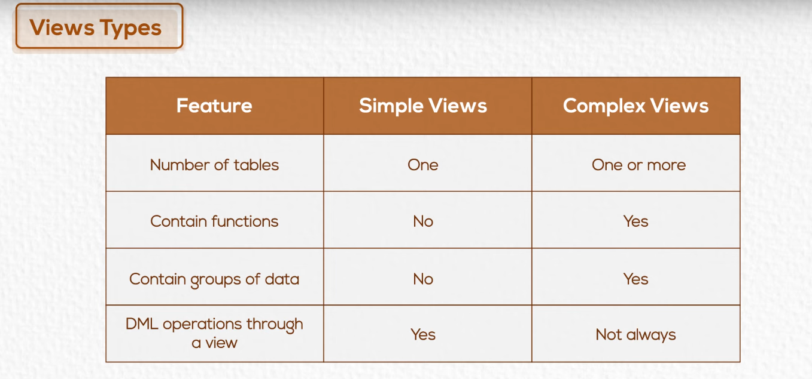
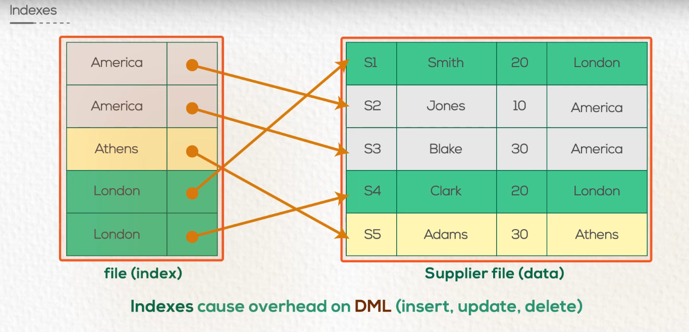

# Chapter 06 SQL other DB objects

### Views

- A view is a **logical table** based on a **table** or **another view**.
- A view contains no data of its own, but is like a **window through** which **data from tables** can be viewed or changed.
- The tables on which a view is based are **called base tables**.
- The **view** is stored as a **SELECT statement** in the data dictionary.

---

### Create views example

```sql
-- Create a view to display employee names and total hours employee worked on a project

create view vw_work_hrs
as
select fname, lname, pname, hours
from employees, project, works_for
where ssn = essn and pno = pnumber;

-- To see the created view use Select
select * from vw_work_hrs
```

---

### Create views with check option example

```sql
-- Create a view for people who were born before 1980 

create view old
as
select *
from employees
where bdate < '1/1/1980'
with check option;

-- To see the created view use Select
select * from old
```

---

### Modifying a view

```sql
-- Modify the view to include only employees from department 10

create or replace view vw_work_hrs
as
select fname, lname, pname, hours
from employees, project, works_for
where ssn = essn and pno = pnumber and dno = 10;

-- To see the created view use Select
select * from vw_work_hrs
```
---

### Removing a view

```sql
drop view vw_work_hrs
```

---


## Advantages of views

    1- Restrict data access
    2- Simplify complex queries
    3- Provide data independence
    4- Present different views of the same data

---



---

## Indexes

- Use indexes to solve the following problems

    1- Not sorted
    
    2- Scattered

### Why indexes?

- They are used to **speed up the retrieval** of records in response to certain search conditions.
- May be **defined** on **multiple columns**.
- Can be created by the **user** or by the **DBMS**.
- Are used and **maintained by the DBMS**.




---

### Create and remove indexes

```Sql

-- Create an index on the salary column of the employees table
create index emp_index on employees(salary)

-- Remove the index
drop index emp_index

```

---

