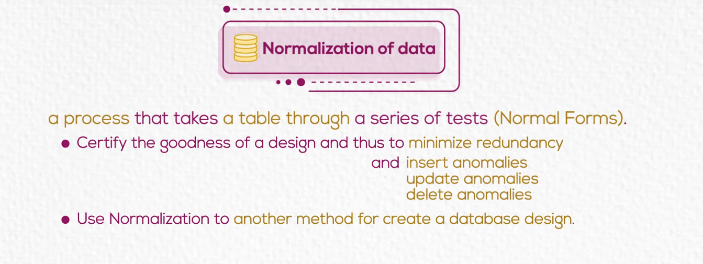
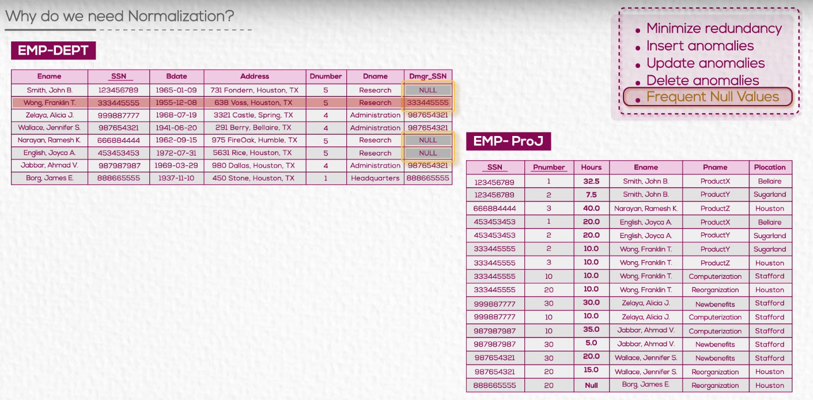
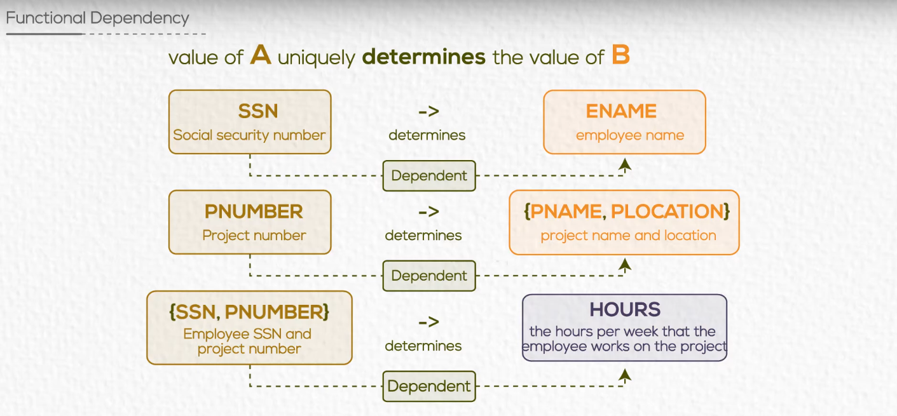
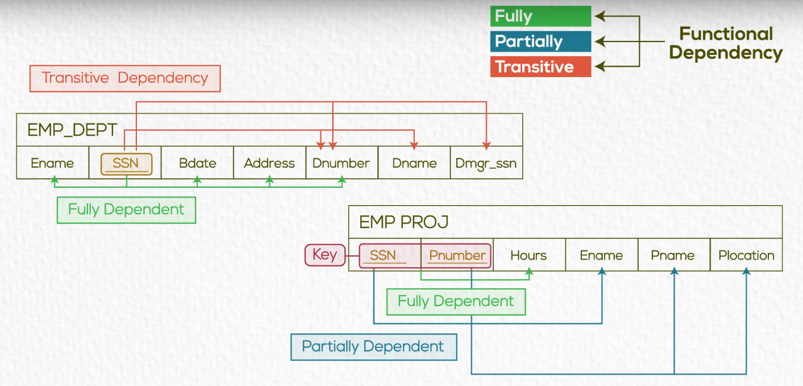
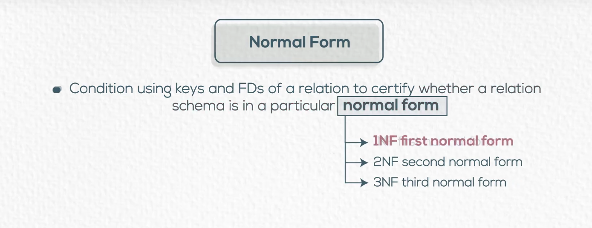
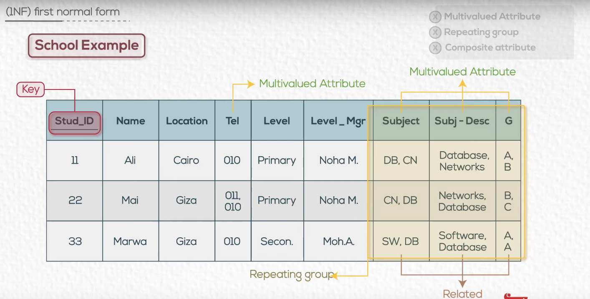
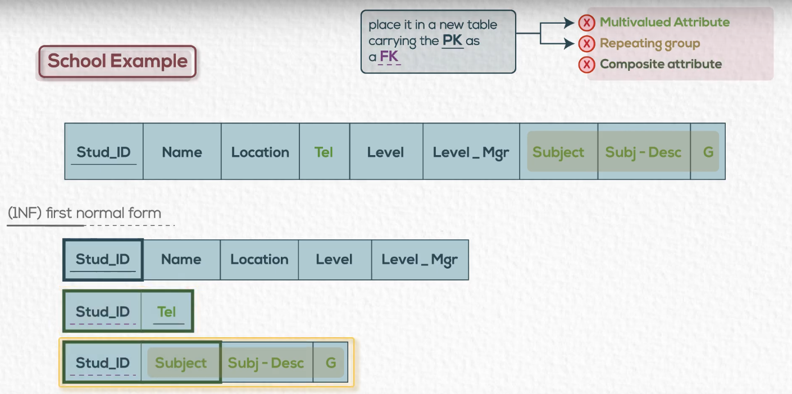
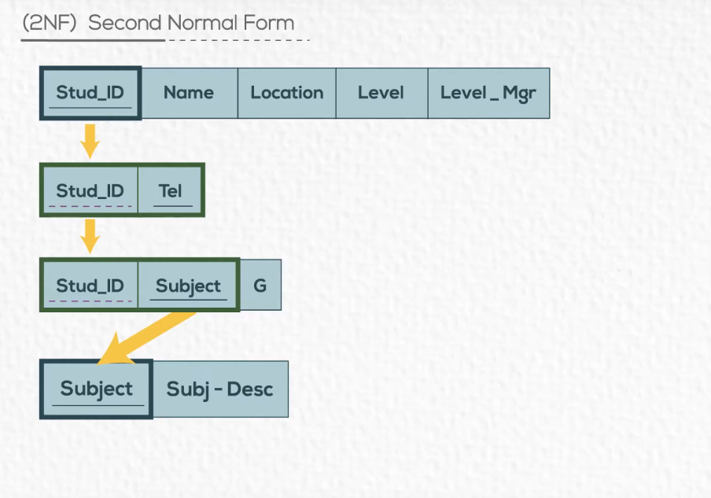
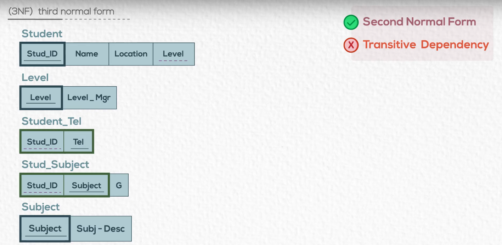
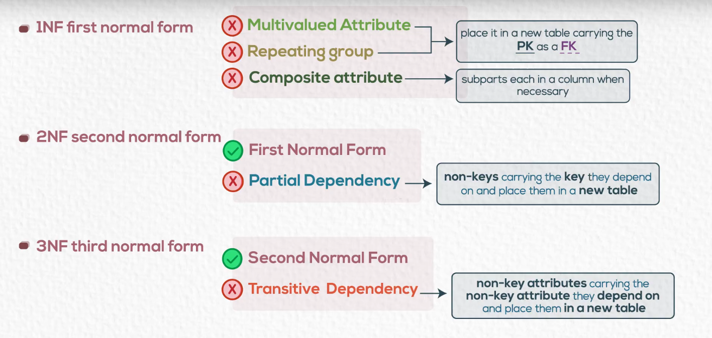

# Chapter 07 Normalization

---

---

---

## Functional Dependency

- A constraint between two attributes (columns) or two sets of columns.

---

---

**Normalization**: The process of decomoposing unsatisfactory "bad" relations by breaking up their attributes into smaller relations.

--- 

--- 

## (1NF) First Normal Form

---

---

## (2NF) Second Normal Form

---

## (3NF) Third Normal Form

---

## Summary

---